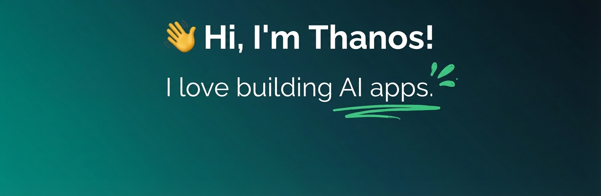

  

## Tech Stack

**Frontend**  

**Backend & Database**  

**Infrastructure & DevOps**  

**Deployment**  

**AI Tools**  

**Editor / IDE**  

## Connect

## Support

If you find my work helpful, consider supporting its development:

